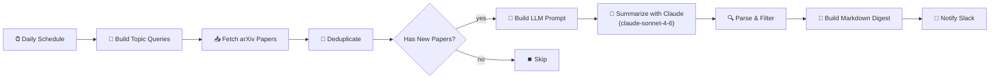

# 📚 Research Literature Digest Agent

An [n8n](https://n8n.io) workflow that discovers new arXiv papers every morning, summarizes them with Claude, scores their relevance to your research profile, and posts a curated Markdown digest to Slack.

## Architecture



Real n8n workflow screenshot:


## What it does

1. A schedule trigger fires once a day (configurable to weekly).
2. Topic queries for **medical imaging**, **code-generation LLMs**, and **multi-agent systems** run against the arXiv API in a single execution.
3. Results are normalized into a common schema: title, authors, abstract, publish date, arXiv link, and PDF link.
4. A deduplication layer backed by n8n workflow static data filters out papers that appeared in previous runs. Entries older than 90 days are pruned automatically so the store stays bounded.
5. Each new paper's abstract is sent to **Claude Sonnet 4.6** with a strict-JSON prompt that returns a plain-language summary, a 1–10 relevance score, and methodology tags.
6. Papers below their topic's relevance threshold are dropped.
7. Surviving papers are grouped by topic, sorted by score, and compiled into a Markdown digest.
8. The digest is posted to a Slack channel via an incoming webhook.

## Bugs fixed from v1

| Issue | What went wrong | Fix in v2 |
|---|---|---|
| **Metadata loss** | The httpRequest node for Claude replaced `item.json` with the API response, so the Parse node lost paper titles, authors, and links. | Parse node now recovers metadata via `$('Build LLM Prompt').all()`. |
| **Prompt bias** | The JSON example showed `"relevance_score": 1`, which nudged the model toward returning 1. | Changed to `<integer 1-10>` placeholder. |
| **Dedup memory leak** | `seenArxivIds` grew without bound across executions. | Entries older than 90 days are pruned each run. |
| **Silent failures** | A single arXiv or Anthropic failure crashed the entire workflow. | Added try/catch around arXiv fetches, `continueOnFail` + retry on the Claude node, and an IF guard for empty batches. |
| **arXiv rate limiting** | Back-to-back requests risked a 429 from the arXiv API. | Added a 3-second delay between topic fetches. |

## Setup

### 1. Import the workflow

Import [`workflows/research-literature-digest-agent.workflow.json`](workflows/research-literature-digest-agent.workflow.json) into your n8n instance.

### 2. Set environment variables

Copy `env.example` and fill in your values:

```bash
cp env.example .env
```

| Variable | Purpose |
|---|---|
| `ANTHROPIC_API_KEY` | Your Anthropic API key (starts with `sk-ant-…`) |
| `SLACK_WEBHOOK_URL` | A Slack [incoming webhook](https://api.slack.com/messaging/webhooks) URL |

If you run n8n with Docker, pass these in your `docker-compose.yml` under `environment:`. For n8n Cloud, add them under **Settings → Environment Variables**.

### 3. Edit the topic buckets

Open the **Build Topic Queries** node and modify the `topics` array. Each entry has three fields:

```js
{
  label: 'Your topic name',          // shown in the digest
  searchQuery: 'cat:cs.CV AND …',    // arXiv query syntax
  threshold: 7                        // minimum relevance score (1-10)
}
```

See the [arXiv API docs](https://info.arxiv.org/help/api/user-manual.html) for query syntax.

### 4. Set the schedule

The trigger node defaults to every day at 08:00 UTC. To switch to weekly on Mondays, change the cron expression to `0 8 * * 1`.

### 5. Activate

Toggle the workflow to **Active** in the n8n editor and it will run on schedule.

## Prompt template

The summarization prompt is documented in [`docs/anthropic-prompt-template.md`](docs/anthropic-prompt-template.md). It asks Claude for strict JSON with three fields: a plain-language summary, a relevance score, and methodology tags.

## Sample output

See [`docs/sample-output.md`](docs/sample-output.md) for an example of the Markdown digest that gets posted to Slack.

## Optional: AI Agent extension

The workflow uses a standard httpRequest node to call the Anthropic API. If you want richer tool-use capabilities (web search for related work, citation lookup, etc.), you can swap it for an n8n **AI Agent** node:

1. Add an AI Agent node (`@n8n/n8n-nodes-langchain.agent`).
2. Configure it with your Anthropic credential and attach any tools you want.
3. Wire it between **Build LLM Prompt** and **Parse and Filter**.
4. Remove the httpRequest-based **Summarize with Claude** node.

The rest of the pipeline stays the same.

## Project structure

```
├── assets/
│   └── workflow-n8n.jfif                           # real n8n workflow screenshot
├── workflows/
│   └── research-literature-digest-agent.workflow.json   # n8n workflow (import this)
├── env.example                                      # environment variable template
├── README.md
└── docs/
    ├── anthropic-prompt-template.md                 # full prompt documentation
    └── sample-output.md                             # example digest
```

## Notes

- The dedup layer uses n8n workflow static data, which is the lightest built-in persistence option. For a production deployment with multiple instances, swap the Deduplicate node for a database-backed store (Postgres, Redis, SQLite) without changing the rest of the pipeline.
- The arXiv API returns Atom XML. The Fetch node parses it with regex rather than pulling in an XML library, which keeps the workflow dependency-free.
- Claude's response is validated with a try/catch JSON parse. Papers whose summaries fail to parse are silently skipped so one malformed response doesn't block the rest of the digest.

## License

MIT
